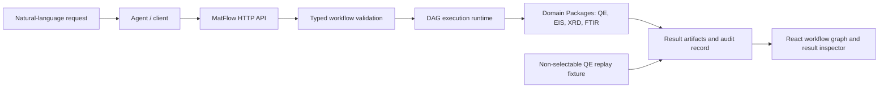

# MatFlow

MatFlow turns materials-science requests into typed, reviewable workflows and auditable results. The backend is authoritative for Tools, workflow validation, execution and task history; the React workbench lives in the sibling repository `matflow-frontend` and uses the versioned HTTP API.

## Architecture



Platform Core provides graph, validation, execution and audit contracts. EIS, XRD, FTIR and QE capabilities are contributed by separate Domain Packages; the demo-only QE fixture is non-selectable by the Agent.

## Install

```powershell
uv sync
uv run matflow diagnose
```

Python 3.11–3.13 is supported. The backend does not require Node.js, npm, or an MCP package.

## Start

```powershell
# Backend only
uv run matflow start --ui none

# Backend and sibling WebUI
uv run matflow start --ui webui
```

The frontend repository is resolved from `--ui-path`, then `MATFLOW_WEBUI_DIR`, then `../matflow-frontend`. With no `--ui`, interactive terminals show a menu and non-interactive sessions start only the backend. `uv run matflow serve` remains an alias for `start --ui none`.

The UI can also be started from `D:\Projects\matflow-frontend` with `npm run dev`; it connects to `http://127.0.0.1:8000/api` by default.

Default endpoints:

- HTTP API: `http://127.0.0.1:8000/api`
- OpenAPI: `http://127.0.0.1:8000/docs`
- Capabilities: `http://127.0.0.1:8000/api/capabilities`

The former backend `/mcp` endpoint was removed in v1. MCP, DSH, and ChatGPT integration is provided by `matflow-frontend`, whose bridge defaults to `http://127.0.0.1:8001/mcp`.

## QE replay demo

Start the backend and WebUI, then choose **Run MgO QE replay demo** from the workbench. The pinned natural-language request builds a four-node workflow: MgO structure → `pw.x` input generation → archived QE output replay → result parsing. The graph shows node states, parameters, parsed total energy, Fermi energy and convergence evidence. The replay is local and labelled as historical; it does not submit a Slurm job.

The same flow is available as `POST /api/qe/demo` with a request such as `{"message":"For pristine MgO SCF, generate a QE input and report energy and convergence."}`. It requires an empty workspace to preserve existing research state.

## Technology and limits

- Python 3.11–3.13, FastAPI, Pydantic, JSON Schema validation, typed DAG execution and versioned Domain Packages.
- React 19, Vite and `@xyflow/react` in the companion frontend repository.
- QE tools generate `pw.x` inputs and parse outputs. The `qe_demo` package provides a historical fixture and is excluded from Router selection. This demo does not run `pw.x`, connect to Slurm, manage pseudopotential files or claim scientific validation of new calculations.
- MatFlow is a single-user local service. Authentication, multi-tenant workspaces, public deployment and remote job scheduling are out of scope today.

## Inspect the flow from the command line

`flowview/` is a read-only CLI subproject that prints the backend flow — the runtime task
lifecycle and the current workspace DAG — as Mermaid diagrams or terminal tables. It is
independent of backend logic: it keeps working when `backend.*` is broken or unimportable, and it
never writes to `data/`.

```powershell
.\.venv\Scripts\python.exe -m flowview graph --format mermaid   # the workspace DAG
.\.venv\Scripts\python.exe -m flowview run-flow --no-color      # the runtime lifecycle
.\.venv\Scripts\python.exe -m flowview summary --limit 5        # recorded task history
.\.venv\Scripts\python.exe -m flowview doctor                   # diagnose sources
```

Offline is the default. Add `--http [URL]` to read the same flows from a *running* backend
(`graph`, `flow --prompt`, `flow --task`, `summary --task`, `doctor`); only `--http` opens a socket,
and it is also the only way to print the server's own routing decision.

See [flowview/README.md](flowview/README.md) for every subcommand, the exit-code and issue-code
tables, and the independence guarantee.

## Test

```powershell
uv run --group dev python -m unittest discover -v
```

Model routing and application scenarios can also be run separately. The
default is deterministic and offline; live gateways are explicitly enabled:

```powershell
.\test_model_scenarios.bat
.\test_model_scenarios.bat -OnlineJev
.\test_model_scenarios.bat -OnlineJev -OnlineLlm
```

Configuration-driven prompt, workflow, and generated-tool suites can be run
separately. Live services require both a case-level permission and the matching
command-line switch:

```powershell
.\test_configured_scenarios.bat
.\test_configured_scenarios.bat -OnlineJev -OnlineLlm
```

See `docs/CONFIGURED_SCENARIO_TESTS.md` for the generic suite contract and the
XRD/FTIR reference-domain fixtures used to exercise it. Those fixtures are test
content, not part of the domain-neutral Platform Core.

The server remains a single-user, single-workspace local service. Multiple clients may connect concurrently; graph writes require the current `base_version`, and stale writes return HTTP 409 with `graph_version_conflict`.

Project documentation:

- [Current status and roadmap](docs/PROJECT_STATUS.md)
- [Design philosophy and implementation architecture](docs/DESIGN_AND_ARCHITECTURE.md)
- [HTTP API contract](docs/BACKEND_API_CONTRACT.md)
