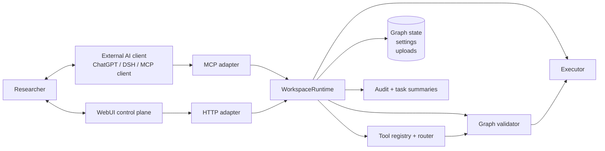

# MatFlow 架构与 AI 开发规则（v1.1）

**状态：** 当前架构基线与实现约束

**读者：** 产品负责人、后端/前端开发者和 AI 编码代理

**范围：** 本地、单用户、由外部 AI 客户端接入的材料研究工作区

文档导航：[文档中心](README.md) · [用户说明书](USER_MANUAL.md) · [接口契约](BACKEND_API_CONTRACT.md)

## 1. Product intent

MatFlow helps materials researchers turn a research request and uploaded data into an **auditable, typed workflow graph**: inspect data, select compatible capabilities, validate a plan, execute it, and expose the resulting state and evidence in a WebUI or MCP client.

The AI agent is outside MatFlow. ChatGPT, DeepSeek Harness, or another MCP client owns conversation and planning; MatFlow owns workspace truth, validation, persistence, and execution. The retired built-in chat loop is not part of the normal architecture.

The v1 demo must make one closed loop reliable:

```text
User request + upload -> inspect/retrieve -> decide -> validate -> execute -> update graph -> show evidence
```

### Goals

- Make analysis workflows explicit as a versioned graph, not hidden prompt state.
- Use typed inputs, outputs, parameters, and schema validation at every tool boundary.
- Preserve an audit trail sufficient to diagnose whether a failure came from retrieval, routing, validation, execution, or presentation.
- Let domain capabilities evolve through a registry and versioned Skill Nodes without destabilizing the executor.
- Keep the first release local, understandable, and testable.

### Non-goals for v1

- Autonomous code changes, dependency installation, or unrestricted shell/network access.
- Fully autonomous invention and publication of unreviewed scientific methods.
- Multi-user accounts, permissions, collaboration, billing, or cloud orchestration.
- A general-purpose laboratory information system or a complete materials simulation platform.
- Business logic in the browser.

## 2. Core architecture



`WorkspaceRuntime` is the deep, transport-neutral module. HTTP and MCP are adapters over the same operations; they must not independently implement routing, graph mutation, upload policy, persistence, or execution semantics.

### Control rules

1. The backend owns task state, registry state, routing, validation, graph mutation, execution, and audit records.
2. The WebUI and MCP clients render returned structured state and send typed user commands. They never mutate persisted graph state directly or interpret unvalidated model output as authoritative.
3. Every graph write is a version-checked, validated `GraphPatch`; the graph is never edited as an unvalidated side effect of a chat response.
4. Every execution receives a validated tool specification and produces a normalized `ExecutionResult`.
5. Reads may run automatically. Dataset import, patch application, execution, and human-decision submission require explicit user approval in AI clients.
6. Advanced Tool Manager actions remain disabled by feature flags until their contracts, review gates, and tests exist.

## 3. Canonical data contracts

All API payloads use JSON. JSON Schema / Pydantic models are the source of truth; TypeScript types are generated from or contract-tested against them. IDs are opaque strings. Timestamps are ISO-8601 UTC strings.

### 3.1 `ToolSpec`

Defines a callable capability. Registry entries are immutable by version.

```json
{
  "tool_id": "eis_basic_qc",
  "version": "1.0.0",
  "label": "EIS Basic Analysis",
  "category": "analysis",
  "description": "Runs basic quality checks over typed EIS data.",
  "input_schema": {"type": "object"},
  "output_schema": {"type": "object"},
  "parameter_schema": {"type": "object"},
  "input_types": {"data": "TypedTable"},
  "output_types": {"report": "EISQCReport", "data": "EISData"},
  "executor_ref": "builtin:eis_basic_qc",
  "risk_level": "low",
  "status": "active",
  "provenance": {"kind": "builtin", "reviewed_by": "maintainer"}
}
```

Required invariants: unique `(tool_id, version)`; declared ports and data types; `additionalProperties: false` where practical; deterministic validation; an executable `executor_ref` only for `active` tools. Custom or generated tools begin as `draft` and cannot execute until reviewed/promoted.

### 3.2 `GraphState`

The durable workflow state. `version` increments exactly once for each accepted patch.

```json
{
  "graph_id": "local-default",
  "version": 12,
  "nodes": [{"id": "qc-1", "tool_id": "eis_basic_qc", "tool_version": "1.0.0", "params": {}, "status": "ready"}],
  "edges": [{"id": "edge-1", "source": "map-1", "source_port": "table", "target": "qc-1", "target_port": "data"}],
  "history": [{"event_id": "evt-001", "kind": "patch_applied", "at": "2026-09-22T00:00:00Z"}],
  "updated_at": "2026-09-22T00:00:00Z"
}
```

Node statuses are `ready`, `running`, `completed`, `waiting`, or `error`. An edge is valid only when its source and target ports exist and their declared types match. Existing `Node`, `Edge`, and `GraphPatch` models are the v1 implementation baseline; evolve them additively and version public API changes.

### 3.3 `RouterDecision`

Records the decision, including alternatives, rather than only the selected tool.

```json
{
  "decision_id": "route-001",
  "task_id": "task-001",
  "graph_version": 12,
  "candidates": [{"tool_id": "eis_basic_qc", "version": "1.0.0", "score": 0.91, "reasons": ["accepts TypedTable", "matches EIS QC intent"]}],
  "selected": [{"tool_id": "eis_basic_qc", "version": "1.0.0"}],
  "confidence": 0.91,
  "rationale": "Best compatible candidate.",
  "requires_human_confirmation": false,
  "created_at": "2026-09-22T00:00:00Z"
}
```

The router may propose, never bypass validation. Low confidence, competing plausible methods, missing units/columns, or high-risk tools must produce a clarification or confirmation requirement.

### 3.4 `ExecutionResult`

Every execution ends in a success, waiting, or error result; raw provider/tool exceptions are retained only in protected diagnostics.

```json
{
  "execution_id": "exec-001",
  "task_id": "task-001",
  "node_id": "qc-1",
  "tool": {"tool_id": "eis_basic_qc", "version": "1.0.0"},
  "status": "completed",
  "output": {"kind": "EISQCReport", "pass": true},
  "output_schema_valid": true,
  "started_at": "2026-09-22T00:00:00Z",
  "finished_at": "2026-09-22T00:00:02Z",
  "error": null,
  "trace_id": "trace-001"
}
```

Allowed statuses: `completed`, `waiting`, `failed`, `cancelled`. A failed result contains a stable error code, safe user message, retryability, and trace ID; it does not leak secrets.

## 4. Module responsibilities

| Module | Owns | Must not do |
| --- | --- | --- |
| External AI client | Conversation, intent parsing, proposing typed calls, asking for approval | Treat model memory as workspace truth or bypass server validation |
| HTTP / MCP adapters | Transport decoding, public schemas, response envelopes | Reimplement runtime policy or write persistence files directly |
| `WorkspaceRuntime` | Stable operations for state, datasets, routing, patches, execution and decisions | Depend on one specific UI or AI provider |
| Task State | Normalize request, available inputs, assumptions, clarification needs | Execute tools or mutate graph |
| Dynamic Tool Registry | Versioned `ToolSpec` discovery and lifecycle | Infer user intent |
| Candidate Retrieval | Find and rank compatible tools | Execute candidates |
| Decision Router | Select/propose a minimal plan with rationale | Skip validation |
| Validator | Schema, type, graph-version, policy, precondition checks | Silently repair scientific ambiguity |
| Executor | Run approved tools in dependency order; normalize results | Change a ToolSpec or route around errors |
| Graph State | Durable versioned graph, patches, history | Present UI-only state as truth |
| Tool Manager | Search, adapt, or scaffold tools behind review gates | Auto-activate generated tools |
| Observability | Correlated audit events and safe diagnostics | Store API keys or unbounded raw sensitive data |
| WebUI | Render state, collect commands, show trace/status | Duplicate backend rules or act as an AI agent |

## 5. Development sequence

Implement in this order; each step is complete only when its tests pass.

1. Freeze the four contracts and expose validation errors as stable API responses.
2. Implement the minimum built-in registry and graph patch validation.
3. Build the closed EIS path: upload -> inspect -> import -> column mapping -> QC -> Nyquist output.
4. Add candidate retrieval and router traces; retain deterministic fallback behavior for demo tools.
5. Add the WebUI as a graph/state viewer and command panel.
6. Add E2E tests and observability dashboards/log views.
7. Add `tool_manager_search`, `tool_manager_adapt`, and `tool_manager_build` feature flags, initially off.
8. Only after review workflow, provenance, sandboxing, and promotion tests exist, enable reviewed custom tools.

## 6. WebUI rules

- Fetch the current `GraphState`, registry read model, task state, and trace summaries from APIs; show loading, waiting, error, and version-conflict states explicitly.
- Send intents and typed commands (`upload`, `chat`, `apply_patch`, `execute`, `confirm`) to the backend. On mutation, send the current `base_version`.
- Render server-returned values as the source of truth. After a mutation, replace/refetch state; do not optimistically invent graph semantics.
- Show, at minimum: selected tool and version, candidate/routing rationale, validation failures, node status, result summary, trace ID, and any human confirmation request.
- Keep presentation mappings (colors, layout, label formatting) in the frontend; keep type compatibility, parameter validation, execution readiness, and scientific decision logic in the backend.
- Never render tool output as trusted HTML. Do not put provider keys, full prompts containing secrets, or raw stack traces in browser state.

## 7. Testing and observability

### Required test layers

- **Unit:** tool parameter validation, port/type compatibility, graph-patch version conflicts, routing policy, and executor error normalization.
- **Contract:** backend JSON models and frontend client types/payloads; every built-in `ToolSpec` has valid schemas and an executable reference.
- **Integration:** upload inspection, graph patch persistence/history, a rejected invalid connection, and a human-decision pause.
- **E2E:** the fixed scenarios below, run against a clean local state.
- **Regression:** every fixed defect adds a test reproducing its original failure before or alongside the fix.

### Required audit fields

Every request carries a `trace_id`; child events carry it plus relevant `task_id`, `decision_id`, `execution_id`, `graph_version`, and `tool_id/version`. Record:

- request and attachment metadata (not secrets or unrestricted file contents);
- retrieval candidates, scores, filters, and selected candidate(s);
- router confidence, rationale, and confirmation policy;
- validation inputs/outcome and stable failure code;
- graph patch ID, base/new versions, operation kinds, and acceptance/rejection;
- execution inputs summarized safely, result schema outcome, duration, status, and error stack in server-only diagnostics.

Logs must be structured JSON, queryable by `trace_id`, and redacted before persistence/display. A failed operation must be diagnosable without rerunning it blindly.

## 8. AI developer rules

1. Work contract-first: change or add a contract before implementing dependent behavior; update backend, frontend, and contract tests in the same change.
2. Read the relevant `ToolSpec`, `GraphState`, API models, and existing tests before editing. Preserve compatible fields and version assumptions.
3. Make the smallest vertical slice that proves behavior. Prefer deterministic built-in implementations before model-driven automation.
4. Treat model output, uploads, registry metadata, and client payloads as untrusted input. Validate at every boundary.
5. Use explicit typed models; avoid `dict[str, Any]` at public boundaries unless a schema-bearing payload genuinely requires it.
6. Make graph mutations only through validated patches with an explicit base version. Return a conflict, never overwrite newer state.
7. Add structured audit events with correlation IDs to each new decision, mutation, and execution path.
8. Keep errors actionable and stable for the UI; retain detailed diagnostics server-side.
9. Implement feature flags with safe defaults and test both enabled and disabled paths.
10. Before declaring work complete, run targeted tests plus the affected E2E scenario; report the exact validated behavior and known limitations.

### Prohibited implementation shortcuts

- Do not let the LLM, WebUI, or a background task write `GraphState` directly.
- Do not execute a tool absent from an active, validated `ToolSpec`.
- Do not silently choose mappings, units, scientific assumptions, or high-risk methods when clarification is needed.
- Do not activate or execute an AI-generated tool without provenance, review/promotion, validation, and tests.
- Do not use hidden prompt state as the sole record of a plan, result, or graph change.
- Do not bypass schemas with parsing fallbacks, broad exception swallowing, `eval`, unrestricted shell calls, or unbounded retries.
- Do not log API keys, authorization headers, private uploads in full, or secrets embedded in prompts.
- Do not couple frontend rendering to internal Python objects; use explicit API models.

## 9. Fixed E2E scenarios

| Scenario | Input / action | Expected outcome |
| --- | --- | --- |
| 1. EIS happy path | Upload a valid CSV; map frequency, real, imaginary columns; request basic QC and Nyquist plot | Correct typed graph is created, each node completes, QC report and plot are shown, all steps share a trace ID |
| 2. Ambiguous columns | Upload a table with two plausible impedance columns; request EIS analysis | Parser/router asks a concise mapping question; no graph execution or guessed mapping occurs |
| 3. Invalid graph connection | Submit a patch connecting incompatible ports | Validator rejects it with stable code; graph version/state remains unchanged; rejection is audited |
| 4. Human gate | Add a `human_decision` node after QC and execute | Executor returns `waiting`; UI shows the prompt/options; downstream work does not run until a recorded response |
| 5. Unavailable/new capability | Request an analysis with no active compatible tool | Router returns no approved selection and offers Tool Manager search only when its feature flag is on; no generated tool executes automatically |

## 10. v1 acceptance checklist

- [ ] Four canonical contracts are implemented, documented, and contract-tested.
- [ ] All graph writes go through version-checked validation and retain history.
- [ ] Built-in tools declare typed ports, schemas, version, executor reference, status, and provenance.
- [ ] The EIS upload-to-Nyquist closed loop works from a clean state.
- [ ] Invalid tool parameters, incompatible edges, stale graph versions, and failed execution return safe structured errors.
- [ ] WebUI is a structured state viewer/control panel and contains no business-rule source of truth.
- [ ] Router candidate list, decision rationale/confidence, validation result, execution result, and trace ID are visible or retrievable.
- [ ] Structured redacted audit logs correlate a request through route, patch, and execution.
- [ ] All five fixed E2E scenarios pass locally.
- [ ] Tool Manager advanced actions are feature-flagged off by default; no generated tool can auto-activate.
- [ ] API keys and secrets remain outside persisted settings, UI state, and logs.

## 11. Change control

Any change to a canonical contract, tool port/type, graph mutation rule, or public API must include: an explicit migration/compatibility decision, updated contract tests, one relevant E2E update, and a note in the change/PR description. Prefer additive changes; deprecate before removal.
