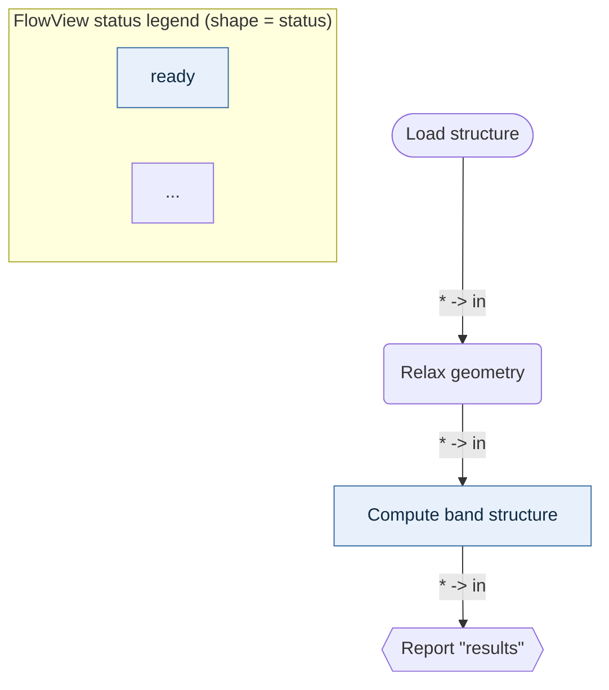

# FlowView — the MatFlow flow printer

`flowview/` is a small, self-contained, **read-only** command line tool that prints *how the
MatFlow backend flows* — the runtime task lifecycle and the current workspace DAG — to the
terminal as [Mermaid](https://mermaid.js.org/) diagrams, terminal tables, or JSON.

It is not part of the backend. It is a **printer that inspects** the backend, built from the
standard library only, so that the offline path keeps working even when `backend.*` cannot be
imported at all.

```powershell
# Canonical invocation on Windows (the repository virtualenv):
.\.venv\Scripts\python.exe -m flowview graph --format text

# Or the launcher, which finds the venv interpreter for you and propagates the exit code:
.\flowview\run_flowview.bat graph --format text
```

No install step is needed: run it from the repository root, where the `flowview` package lives.
FlowView works on Python 3.11+ (it is validated on the repository's 3.12 virtualenv).

---

## 1. The independence guarantee (and why it matters)

> **A printer must not depend on the thing it is inspecting.**

If FlowView imported `backend.main` to describe the flow, then *exactly when you need it most* —
while the backend is broken, half-migrated, or missing a dependency — FlowView would fail too,
and you would lose your only tool for seeing what is wrong. FlowView therefore keeps its own
mirror model (`model.py`), its own readers (`loader.py`, `trace.py`, `tasks.py`,
`workspace.py`), and its own renderers (`mermaid.py`, `text.py`, `jsonout.py`).

What that means in practice:

* `import flowview` and every `python -m flowview` command keep working when `backend` raises
  `ImportError`. There is no module-level `import backend...` anywhere in `flowview/`.
* The only optional backend contact is `flowview/backend_adapter.py`, and every entry point in
  it is lazy and wrapped: on failure you get an offline document plus a visible issue whose
  `hint` tells you what to do next — never a traceback.
* FlowView never writes into `data/`, never starts a server, and never calls a state-mutating
  backend path. `flowview graph` on a healthy workspace leaves every file's size and mtime
  exactly as it found them.
* Network access is **opt-in and structural**: it exists only behind `--http`, so in offline mode
  no subcommand imports the HTTP client and no socket is opened — not even when `MATFLOW_API_URL`
  points at a running server.

The test suite enforces all of this: `flowview/tests/test_offline_independence.py` installs a
`sys.meta_path` finder that raises `ImportError` for `backend` and `backend.*` in fresh
interpreters, runs the CLI under it, and snapshots the real `data/` tree before and after a full
sweep of every subcommand.

---

## 2. Subcommands

All examples below were run from the repository root against a small **demo** workspace — a temporary
data root holding a `graph_state.json` with 4 nodes / 3 edges, a `trace.jsonl` with 3 events and a
task-summary log with 2 tasks. They illustrate the output shapes; they are not a snapshot of this
repository's current `data/`, which holds whatever the backend last wrote. Common options may be
written **before or after the subcommand**; both spellings are equivalent and pinned by tests.

| Command | Purpose | Exit codes |
| --- | --- | --- |
| `graph` | print the current workspace graph as a diagram/table | 0 ok, 3 missing/corrupt source |
| `flow` / `run-flow` | print the canonical runtime phase map (`--blueprint`), or replay one recorded task (`--task`, `--from`) | 0 ok, 3 unusable source |
| `summary` | newest recorded task summaries as a timeline/tables | 0 ok, 3 no summaries |
| `doctor` | diagnose sources, backend import, terminal | 0 healthy, 3 a source or the backend is unusable |

> `CONTRACT.md` also lists exit `1` for `doctor` ("broken sources"). The current implementation
> reports an unreadable-but-existing source as exit `3` (a source problem) and reserves `1` for
> unexpected internal errors, which is what the table above shows.

### `graph` — the workspace DAG

```powershell
.\.venv\Scripts\python.exe -m flowview graph --format mermaid
```



Real output (trimmed). Note how the label `Report "results"` is escaped to
`Report #quot;results#quot;` — Mermaid labels are always sanitised, and output never contains
ANSI escapes.

```powershell
.\.venv\Scripts\python.exe -m flowview graph --format text --width 100
```

```text
Workspace graph: graph_state.json
────────────────────────────────────────────────────────────────────────
source     : ...\data\graph_state.json
graph      : demo, version 4, nodes 4, edges 3, layers 4
phases     : 3
issues     : 0 error(s), 0 warning(s)

Phases (3)
  [1] Workspace graph (graph)  [completed]
  [2] Topology (structural, not a run) (topology)  [completed]
       1. topological order  [completed]
          detail     : 4 node(s) in 4 layer(s); 3 edge(s)
  [3] Nodes (structural) (nodes)  [error]
       1. Report "results"  [error]
          error      : ValueError: k-path is missing

Nodes (4)
┌────────┬────────────────────────┬─────────────────────┬───────────┬────────────────────────┐
│ Id     │ Label                  │ Tool                │ Status    │ Error                  │
├────────┼────────────────────────┼─────────────────────┼───────────┼────────────────────────┤
│ report │ Report "results"       │ tool.report         │ error     │ ValueError: k-path is  │
│ relax  │ Relax geometry         │ tool.relax          │ running   │ -                      │
│ bands  │ Compute band structure │ tool.bands          │ ready     │ -                      │
│ load   │ Load structure         │ tool.load_structure │ completed │ -                      │
└────────┴────────────────────────┴─────────────────────┴───────────┴────────────────────────┘

Edges (3)
│ Source │ Target │ Ports   │ ...
│ bands  │ report │ * -> in │
│ load   │ relax  │ * -> in │
│ relax  │ bands  │ * -> in │

Status legend
  ready      : declared, never run
  running    : execution in progress
  ...
```

```powershell
.\.venv\Scripts\python.exe -m flowview graph --format json
```

```json
{
  "flowview_schema": "1.0",
  "document": {
    "title": "Workspace graph: graph_state.json",
    "source": "...\\data\\graph_state.json",
    "graph": {
      "graph_id": "demo",
      "version": 4,
      "nodes": [
        {
          "id": "load",
          "label": "Load structure",
          "tool_id": "tool.load_structure",
          "tool_version": "1.0.0",
          "status": "completed",
          "params": {},
          "issues": [],
          ...
        }
      ],
      "edges": [ ... ],
      "issues": [],
      "truncated": []
    },
    "trace": null,
    "phases": [ ... ],
    "issues": [],
    "meta": { ... }
  },
  "phases": [ ... ],
  "issues": [ ... ],
  "exit_code_hint": 0
}
```

`json` mode prints **exactly one** JSON document and nothing else on stdout (the human-readable
status block is suppressed), so `python -m flowview graph --format json | ConvertFrom-Json`
always works — even when the source is corrupt (the document is still printed and the process
exits 3) and even when the command line itself is wrong (a usage error exits 2 with one
`cli.usage` document instead of argparse prose).

Useful `graph` options: `--direction TD|TB|LR|RL|BT`, `--focus NODE_ID [--radius N]`,
`--status S` (repeatable), `--tool ID_OR_CATEGORY` (repeatable), `--search TEXT`, `--layers`,
`--no-legend`, `--graph-file PATH`.

### `run-flow` (alias `flow`) — the runtime lifecycle

```powershell
.\.venv\Scripts\python.exe -m flowview run-flow --blueprint
```

```text
MatFlow backend runtime flow (blueprint)
────────────────────────────────────────────────────────────────────────
source     : flowview phase blueprint
phases     : 7
issues     : 0 error(s), 0 warning(s)
meta       : mode=blueprint, phases=7, steps=28, modes=blueprint

Phases (7)
  [1] Request and trace correlation (request)  [pending]
       1. request accepted  [pending]
          detail     : Blueprint (described, not observed): backend/main.py: chat() ->
                       audit('chat.received') then TaskState(...)
       2. trace id assigned  [pending]
  [2] Routing (candidate retrieval + decision) (route)  [pending]
  [3] Human-confirmation gate (confirm)  [pending]
  [4] Graph patch (validate -> apply) (patch)  [pending]
  [5] Execution (DAG scheduling, executor seam, preview) (execute)  [pending]
  [6] Review gate (review_policy.after_run -> waiting) (review)  [pending]
  [7] Persistence and audit (persist)  [pending]
```

The blueprint is documentation-as-data: seven phases (`request` → `route` → `confirm` → `patch`
→ `execute` → `review` → `persist`) with 28 steps, each naming its backend seam in `detail`.
`--blueprint` is the default when neither `--task`, `--from` nor `--prompt` is given.

```powershell
.\.venv\Scripts\python.exe -m flowview flow --task route-eis
```

Prints the recorded lifecycle of one task: which candidates were considered, which tool was
selected and with what confidence, whether a human confirmation was required, and how it ended.

#### `--prompt` — print the flow for one request

```powershell
.\.venv\Scripts\python.exe -m flowview flow --prompt "Run basic EIS quality checks on this dataset" --no-color
```

This is the mode to use when you want to see **what the backend would do with a given prompt**,
including a long one. It runs `backend.routing.DecisionRouter` read-only: no model call, no
`record_routing()`, no graph write. The document has three phases:

```text
Phases (3)
  [1] Prompt (input) (prompt)  [completed]
      1. user prompt            [completed]   detail: Run basic EIS quality checks on this dataset
      2. prompt size            [completed]   detail: 44 character(s), 8 token(s); input types: RawData, TypedTable
      3. retriever tokenisation [completed]   detail: ... 8 occurrence(s), 8 distinct token(s); 0 CJK character(s)
  [2] Candidates (candidates)  [pending]
      1. eis_basic_qc (candidate)  [pending]  detail: candidate only, nothing executed; score 1.00; ...
  [3] Decision (decision)  [waiting]
      1. selected eis_basic_qc     [waiting]  detail: confidence 1.00; human confirmation required: no; ...
```

Prompts longer than the backend's 4000-character `TaskState.user_message` limit are still rendered
in full, but routing uses a **preview** that keeps the Latin fragments the tokeniser can see. The
flow says so (`route.prompt_shortened_for_routing`, and `routing used a N-character preview` in the
`prompt size` step) instead of pretending the whole request reached the router.

> **A finding this mode makes visible.** `backend/routing.py` tokenises prompts with
> `re.findall(r"[a-z0-9]+")` and keeps the resulting **set**, so **CJK characters produce no tokens
> at all**. A long Chinese request is therefore nearly invisible to lexical retrieval and whatever
> Latin fragments it contains (file names, column headers, units) decide the route — a
> 595-character EIS request can land on `ebrick_case05_import`. When that happens the flow says so
> explicitly: the `retriever tokenisation` step turns amber and an issue code
> `route.prompt_tokens_unusable` explains the counts (occurrences, distinct tokens, CJK characters).
> This is a backend routing limitation that the printer reports faithfully; it is not a printer
> defect. Adding one English keyword to the request, or using the JEV/model router, is the
> workaround.

#### `--http` — read the flow from a running backend

Offline is the default: without this flag no subcommand opens a socket. `--http` points FlowView at
a **running** MatFlow backend and reads the same flows over the versioned HTTP contract
(`matflow-http` 1.0) — this is the mode to use when you want the *server's* answer, not a mirror of
the files it happens to have written.

```powershell
# Ask the running backend what it would do with this request:
.\.venv\Scripts\python.exe -m flowview flow --prompt "run basic EIS quality checks" --http http://127.0.0.1:8000

# The live workspace graph, one recorded task, or a live diagnosis:
.\.venv\Scripts\python.exe -m flowview graph --http
.\.venv\Scripts\python.exe -m flowview summary --task task-live-0001 --http
.\.venv\Scripts\python.exe -m flowview doctor --http
```

| Spelling | Meaning |
| --- | --- |
| `--http URL` | use this origin (for example `http://127.0.0.1:8000`) |
| `--http` (no value) | use `MATFLOW_API_URL`, then `MATFLOW_BACKEND_URL`, then `http://127.0.0.1:8000` |
| `--http-timeout SECONDS` | how long to wait for one request (default 5) |

What each subcommand reads, and what it does **not** do:

| Command | Endpoint | Notes |
| --- | --- | --- |
| `graph --http` | `GET /api/state` | mirrors `payload["state"]`; `--full` disables the node/edge caps exactly as offline |
| `flow --prompt TEXT --http` | `POST /api/route` | the backend decides; the request declares the graph version read from `/api/state` |
| `flow --task ID --http`, `summary --task ID --http` | `GET /api/task-summaries/{ID}` | one recorded task, mirrored like a local record |
| `doctor --http` | `GET /api/capabilities` | the whole offline report plus a `Live backend (--http)` section |

Combinations that cannot work are refused with exit 2 rather than guessed at: `--http` with
`--graph-file`, `--from-file` or `--file` (`cli.conflicting_sources`); `flow --http` without
`--task`/`--prompt` (`cli.http_needs_source` — the blueprint is built in and `--from-file` is a
local file); `summary --http` without `--task` (`cli.http_needs_task` — the contract has no
summary-list endpoint). In live mode FlowView reads nothing from disk, so `--data-root` has no
effect on a command that uses `--http` (`doctor --http` still reports the local sources as well).

> **`--prompt --http` is the one call that makes the backend write something.** `POST /api/route`
> returns a decision and records a routing summary in the backend's own task-summary log (and may
> consult the routing model). The document says so: `http.route_recorded` is an **info** issue naming
> the recorded task id when the answer carries it, a **warning** when the answer could not be read or
> the backend never answered (so an unknown side effect is never presented as a neutral fact), and it
> is absent altogether when nothing was sent — for example when the prompt cannot be serialised. Use
> offline `--prompt` when you want a preview that persists nothing. `http.model_router_used` appears
> when the backend reports routing-model evidence. FlowView itself never writes on any `--http` path,
> and the graph is never patched.

Live failures are reported, never faked: an unreachable server (`http.unreachable`, exit 3), a
mistyped origin (`http.capabilities.invalid_url`), an origin that embeds credentials
(`cli.http_credentials`, exit 2, refused before any request so the credential is never printed), a
payload that is not JSON (`http.state.invalid_json`), a response without the expected object
(`http.state_missing`), a 404 for an unknown task (`http.task_summary.http_error`) or a backend
speaking a different contract (`http.contract_mismatch`, a warning; `--strict` turns it into exit 3).
**Redirects are not followed** (`http.<endpoint>.http_error`): a flow has to come from the origin you
named, so a hop that tries to send FlowView elsewhere — especially to a URL with credentials — is
reported rather than obeyed. A long prompt is sent as its own first 4000 characters and that is
disclosed with `http.prompt_truncated_for_backend` — no marker, placeholder or summary text authored
by FlowView ever enters the router query.


```powershell
.\.venv\Scripts\python.exe -m flowview run-flow --from-file .\data\trace.jsonl
```

```text
MatFlow recorded trace
────────────────────────────────────────────────────────────────────────
source     : ...\data\trace.jsonl
trace      : events 3, failed 1, task (none)
phases     : 3

Phases (3)
  [1] request  [completed]
       1. request.received  [completed]
          detail     : prompt recorded
  [2] route  [completed]
       1. route.decide  [completed]
          tools      : tool.bands
  [3] execute  [error]
       1. execute.node  [error]
          error      : ValueError: k-path is missing
```

Accepted trace shapes: a JSON array of events, `{"events": [...]}`, a `/api/chat` result
(`{"trace": [{"tool": ..., "ok": ..., "result"/"error": ...}]}`), a single event object, a task
summary object, or JSON Lines with one payload per line. Unreadable lines are reported as
`trace.bad_jsonl_line` warnings and the rest of the file is still printed.

### `summary` — recorded task history

```powershell
.\.venv\Scripts\python.exe -m flowview summary
```

```text
MatFlow task summary timeline
────────────────────────────────────────────────────────────────────────
source     : ...\data\audit\task_summaries.jsonl
phases     : 2
issues     : 1 error(s), 0 warning(s)
meta       : mode=recorded, tasks=2, tasks_total=2, records=2, failed=1, statuses=completed=1,
             failed=1, modes=recorded

Phases (2)
  [1] task task-0001 (task-0001)  [completed]
       1. Route  [completed]
       2. Execute  [pending]
       3. Outcome  [completed]
  [2] task task-0002 (task-0002)  [error]
       2. Execute  [error]
          detail     : 2 step(s): 2 error; first error: no execution recorded

Issues (1)
┌──────────┬─────────────┬────────────────────────────────────┬──────────────────────────────┐
│ Severity │ Code        │ Message                            │ Where                        │
├──────────┼─────────────┼────────────────────────────────────┼──────────────────────────────┤
│ error    │ task.failed │ 1 of 2 displayed task(s) ended in  │ ...\audit\task_summaries.jsonl│
│          │             │ a failed state.                    │                              │
└──────────┴─────────────┴────────────────────────────────────┴──────────────────────────────┘
```

`summary` shows the newest `--limit N` tasks (default 10) as one phase per task, and exits 3 when
a displayed task ended in a failed state or when there is no summary log at all. `--task TASK_ID`
replays one record in full; `--file PATH` reads an explicit log.

### `doctor` — diagnose the environment

```powershell
.\.venv\Scripts\python.exe -m flowview doctor
```

```text
FlowView 0.1.0 doctor

Runtime sources
  ok   graph state      D:\Projects\matflow\data\graph_state.json
       102 bytes
  ok   task summaries   D:\Projects\matflow\data\audit\task_summaries.jsonl
       198587 bytes
  ok   uploads          D:\Projects\matflow\data\uploads
       directory with 4 entries
  ok   settings         D:\Projects\matflow\data\settings.json
       9190 bytes
  ok   backend package  D:\Projects\matflow\backend\workspace_runtime.py
       34804 bytes

Renderers
  ok   mermaid  MermaidRenderer
  ok   text     TextRenderer
  ok   json     JsonRenderer

Optional backend adapter
  ok   backend is importable (read-only adapter mode available)

Terminal
  encoding  utf-8
  isatty    False
  color     auto

Task summary log: D:\Projects\matflow\data\audit\task_summaries.jsonl
FlowView 0.1.0: all offline sources are usable.
```

`doctor --list` additionally prints every audited path. A line marked `--` is merely *absent*
(not a problem); a line marked `FAIL`, or an existing-but-unreadable source, exits 3.

---

## 3. Format matrix

| Format | Flag | What it is for | Guarantees |
| --- | --- | --- | --- |
| mermaid | `--format mermaid` | paste into docs, GitHub, mermaid.live | valid `flowchart`/`sequenceDiagram`/`stateDiagram-v2`, deterministic order, no ANSI, labels escaped (`"` → `#quot;`, newline → `<br/>`, empty label → node id) |
| text | `--format text` (default) | reading in a terminal | never wider than `--width` when set (down to the 20-column floor); statuses always spelled out; box-drawing glyphs on a terminal or a UTF-8 stream, ASCII `+-|` when the stream cannot carry them |
| json | `--format json` | scripting, diffs, feeding back into FlowView | exactly one JSON document on stdout, `flowview_schema` = `"1.0"`, keys `document`, `phases`, `issues`, plus `graph_stats`/`trace_summary` when available |

| Global option | Effect |
| --- | --- |
| `--format {mermaid,text,json}` | output format (default `text`) |
| `--out PATH` | write the document to a file (parent directories are created) and print a one-line notice on stdout |
| `--width N` | text width; `0` auto-detects, `100` is the fallback. The floor is 20 columns: a smaller request is raised to 20 with a one-line note on stderr |
| `--data-root PATH` | workspace root to read instead of the repository |
| `--http [URL]` | read the flow from a running backend over HTTP instead of local files; bare `--http` uses `MATFLOW_API_URL` or `http://127.0.0.1:8000` (offline stays the default) |
| `--http-timeout SECONDS` | how long to wait for one `--http` request (default 5) |
| `--graph-file PATH` | read a specific `graph_state.json` |
| `--full` | disable the node/edge/event caps |
| `--strict` | promote `warning` issues to exit 3 |
| `--no-color` | disable ANSI colour; no information is lost |
| `-v`, `--verbose` | print tracebacks and issue `detail` |

---

## 4. Error handling and exit codes

Copied from the frozen contract (`flowview/CONTRACT.md`):

| Code | Meaning |
| --- | --- |
| `0` | success |
| `1` | unexpected internal error (a bug; run with `-v` for a traceback) |
| `2` | usage error |
| `3` | input/backend problem, reported as a readable issue list — never a traceback unless `-v` |

`--strict` promotes `warning` issues to exit `3`. Malformed input is converted into a
`FlowIssue` and printing continues; FlowView never raises out of a reader or a renderer for
malformed input.

Every issue has a stable machine code, a severity (`info` | `warning` | `error`), a one-sentence
English message and, where known, a `where` and a concrete `hint`. The vocabulary:

| Group | Codes |
| --- | --- |
| CLI / rendering | `cli.no_command`, `cli.usage`, `cli.limit_clamped`, `cli.out_failed`, `cli.conflicting_sources`, `cli.http_needs_source`, `cli.http_needs_task`, `cli.http_credentials`, `cli.empty_prompt`, `render.unsupported`, `render.failed`, `render.json_failed`, `flowview.source_unusable`, `flowview.internal_error`, `doctor.problems` |
| Graph source | `graph.missing_file` (info if the workspace was never run, error if `--graph-file` named a missing path), `graph.empty` (info), `graph.is_directory`, `graph.unreadable`, `graph.permission_denied`, `graph.undecodable`, `graph.too_large`, `graph.too_deep`, `graph.invalid_json`, `graph.not_an_object`, `graph.nodes_missing`, `graph.edges_missing`, `graph.nodes_not_a_list`, `graph.edges_not_a_list`, `graph.bad_version` |
| Paths | `path.symlink_loop`, `path.invalid` |
| Graph nodes | `graph.node_not_an_object`, `graph.node_missing_id`, `graph.node_identity_mismatch`, `graph.node_status_missing`, `graph.node_status_unknown`, `graph.node_error_without_message` |
| Graph edges / DAG | `graph.edge_not_an_object`, `graph.edge_missing_endpoint`, `graph.dangling_edge`, `graph.duplicate_node`, `graph.duplicate_edge`, `graph.multiple_edges_into_port`, `graph.cycle` |
| Trace | `trace.missing_file`, `trace.is_directory`, `trace.unreadable`, `trace.permission_denied`, `trace.undecodable`, `trace.too_large`, `trace.empty_file`, `trace.no_document`, `trace.no_documents`, `trace.invalid_json`, `trace.bad_jsonl_line`, `trace.bad_line`, `trace.empty_input`, `trace.invalid_event`, `trace.unknown_payload`, `trace.unknown_status`, `trace.missing_status`, `trace.event_without_tool`, `trace.event_missing_ok`, `trace.no_events`, `trace.chat_error` |
| Task summaries | `task.no_summary_log`, `task.not_found`, `task.empty_file`, `task.unparsable_line`, `task.invalid_json`, `task.too_large`, `task.undecodable`, `task.unreadable`, `task.empty_payload`, `task.missing_status`, `task.unknown_status`, `task.failed`, `task.missing_decision`, `task.unknown_execution_status`, `task.multiple_records` |
| Filters and focus | `filter.applied` (info: how many nodes a filter hid), `filter.unknown_status` (warning: a `--status` value outside the vocabulary), `focus.unknown_node` |
| Optional backend adapter | `backend.schema_failed`, `backend.route_failed`, `route.dry_run`, `route.empty_prompt`, `route.prompt_shortened_for_routing`, `route.prompt_tokens_unusable`, `route.unknown_input_type`, `graph.unreachable`, `graph.http_error` |
| Live HTTP mode (`--http`) | `http.live`, `http.unreachable`, `http.contract_mismatch`, `http.capabilities.invalid_url`, `http.unserialisable_request`, `http.state` + `http.capabilities` + `http.task_summary` + `http.route` × `http_error` / `unreachable` / `invalid_json` / `request_failed`, `http.state_missing`, `http.task_summary_not_an_object`, `http.graph_version_unknown`, `http.unknown_input_type`, `http.prompt_truncated_for_backend`, `http.route_payload_invalid`, `http.empty_prompt`, `http.route_recorded`, `http.model_router_used` |

Exit-code examples:

```text
default graph file never created    -> exit 0  (info: graph.missing_file)
--graph-file names a missing path   -> exit 3  (error: graph.missing_file)
--graph-file is a symlink loop       -> exit 3  (error: path.symlink_loop)
graph JSON nested 5000 levels       -> exit 3  (error: graph.too_deep)
graph file is `[]`                  -> exit 3  (error: graph.not_an_object)
node with an unknown status         -> exit 0  (warning: graph.node_status_unknown; node shows `unknown`)
same graph with --strict            -> exit 3
two nodes with the same id          -> exit 3  (error: graph.duplicate_node)
two edges into one input port       -> exit 0  (warning: graph.multiple_edges_into_port)
graph contains a cycle              -> exit 0  (warning: graph.cycle); with --strict -> exit 3
trace file missing                  -> exit 3  (error: trace.missing_file)
trace file is empty (0 bytes)       -> exit 3  (error: trace.no_document)
one broken JSONL line               -> exit 0  (warning: trace.bad_jsonl_line; other lines printed)
unknown subcommand                  -> exit 2
a 2000-node graph                   -> exit 0, 500 nodes printed, `truncated: ["nodes>500"]`
a 3000-node chain with --full       -> exit 0, every node printed (the walk is iterative)
any hard source error with --format json -> exit 3 and one valid error document on stdout
a hard usage error with --format json -> exit 2 and one cli.usage error document on stdout
--format json --out <unwritable>  -> exit 3 and one cli.out_failed document on stdout
--format text --out <unwritable>  -> exit 3, message on stderr, nothing on stdout
graph --http <no server here>     -> exit 3 (error: http.unreachable)
graph --http not-a-url            -> exit 3 (error: http.capabilities.invalid_url)
graph --http <server answers 404> -> exit 3 (error: http.capabilities.http_error)
a 5000-level-deep backend answer  -> exit 3 (error: http.<endpoint>.invalid_json)
flow --prompt X --http <broken route answer> -> exit 3, plus http.route_recorded (warning)
summary --http (no --task)        -> exit 2 (error: cli.http_needs_task)
graph --http URL --graph-file P   -> exit 2 (error: cli.conflicting_sources)
```

Caps: `MAX_NODES = 500`, `MAX_EDGES = 2000`, `MAX_EVENTS = 500` (trace replay),
`MAX_READ_BYTES = 32 MiB`, `summary --limit` defaults to 10. Every applied cap is recorded in
`truncated` and mentioned in the text output, so output is never truncated silently.
`--full` disables the node/edge/event caps.

---

## 5. How to read the output

**Statuses.** Node statuses are `ready` (declared, never run), `running`, `completed`,
`waiting` (paused for a human decision), `error`, `cancelled`, and `unknown`. `unknown` is
FlowView's own value: the source did not carry a status FlowView recognises. It is **never**
silently shown as `completed`. Steps additionally use `pending` and `skipped`. The text renderer
always spells the status out in words, so `--no-color` loses no information.

**Phases.** A `FlowDocument` carries one *canonical checkout* of the flow:

1. phases you supplied explicitly (`summary` builds one phase per task);
2. otherwise the phases *derived from a recorded trace* (events grouped by phase);
3. otherwise the structural phases derived from the graph: the workspace graph itself, its
   topology, and its nodes — which is what lets `graph` show a flow for a workspace that has
   never run.

A phase's status is the worst status of its steps
(`error` > `running` > `waiting` > `completed` > `pending`).

**Layers.** For a DAG, `graph_layers()` groups nodes into dependency layers (longest-path
depth), printed as `layer 0`, `layer 1`, … . A dangling edge is ignored for layering so a
partially broken graph still prints; a cycle is reported as `graph.cycle` / "cycle detected; no
valid topological order" instead of crashing.

**Caps.** When a cap applies, the text output says so and the JSON carries
`document.truncated`, e.g. `["nodes>500"]`.

---

## 6. How to extend FlowView

Everything is standard library only, and the extension seams are three small interfaces:
`FlowDocument` (the single renderer input), `build_document()` (the document assembler), and a
class with `format` + `render_document()` (a renderer).

### Add a source

```python
# flowview/mysource.py
"""Read my own flow source without ever importing backend."""
from __future__ import annotations

import json
from pathlib import Path

from .analysis import build_document
from .model import FlowDocument, FlowGraph, FlowIssue


def read_mysource(path: Path) -> FlowDocument:
    """Total: a missing or malformed file becomes an issue, never an exception."""
    if not path.exists():
        return build_document(
            title="My source",
            source=str(path),
            issues=(FlowIssue(
                severity="info",
                code="mysource.missing_file",
                message=f"No source file yet: {path}",
                where=str(path),
                hint="Run the producing job once, then retry.",
            ),),
        )
    try:
        payload = json.loads(path.read_text(encoding="utf-8"))
    except (OSError, ValueError) as exc:
        return build_document(
            title="My source",
            source=str(path),
            issues=(FlowIssue(severity="error", code="mysource.invalid_json",
                              message=f"Cannot read {path}: {exc}", where=str(path)),),
        )
    graph = FlowGraph(graph_id=str(payload.get("id", "local-default")), source=str(path))
    return build_document(title="My source", source=str(path), graph=graph)
```

Then wire it into `cli.py`: add a subparser in `build_parser()`, add a `command_mysource(args,
style)` that calls `_emit(_render(document, args, style), args)`, `_announce(...)` and returns
`exit_code_for(document.all_issues(), strict=args.strict)`, and register it in `COMMANDS`.
`build_document()` merges the issues of the graph/trace and picks the canonical phases for you.

### Add a renderer

```python
# flowview/csvout.py
"""Comma-separated renderer: one row per node."""
from __future__ import annotations

import csv
import io
from typing import ClassVar

from .model import FlowDocument


class CsvRenderer:
    format: ClassVar[str] = "csv"

    def __init__(self, *, delimiter: str = ",") -> None:
        self.delimiter = delimiter

    def render_document(self, document: FlowDocument) -> str:
        buffer = io.StringIO()
        writer = csv.writer(buffer, delimiter=self.delimiter, lineterminator="\n")
        writer.writerow(("id", "label", "status"))
        for node in (document.graph.nodes if document.graph else ()):
            writer.writerow((node.id, node.display, node.status))
        return buffer.getvalue()
```

Then add `"csv"` to `cli.FORMATS` and return `CsvRenderer()` from `cli._renderer()`. A renderer
must never print, must return a `str`, must not contain ANSI escapes, and must not raise for
malformed input — convert what you cannot render into a `FlowIssue` on the document instead.

### Tests

```powershell
.\.venv\Scripts\python.exe -m unittest discover -s flowview/tests -t . -v
python -m pytest flowview/tests -q
```

The suite is hermetic: every fixture is a `tempfile.TemporaryDirectory`, `MATFLOW_DATA_ROOT`
points at it, no server is started and `backend` is never imported at module import time.

### Batch-print a whole prompt suite

`flowview/tools/` holds report generators that are not part of the CLI. The most useful one takes
a suite of prompts, prints the flow for each, and writes every diagram to disk so the output can be
browsed:

```powershell
.\.venv\Scripts\python.exe -m flowview.tools.run_prompt_cases `
  --suite examples/long_prompt_cases.json `
  --out   examples/reports/prompt_flows
```

The shipped suite is `examples/long_prompt_cases.json`: 16 deliberately long prompts (389–2124
characters, ~11.5k characters in total) covering EIS, XRD, FTIR, UV-Vis, TGA, DSC, four-point
probe, a cross-technique request, two under-specified requests and two prompts that try to talk the
runtime out of its safety rules. Each case carries `expected_route`, `route_expectation_note`,
`observed_route` and a `route_verdict` (`as_expected` / `expected_unsupported` / `misrouted`), so a
wrong route is recorded as a wrong route instead of being quietly accepted.

Output layout (one directory per case, plus two shared sections):

| Path | Contents |
| --- | --- |
| `INDEX.md` | verdict counts, the routing-observations table (misroutes and false matches with links), the prompt index, the recorded-task section and the stage table |
| `PROMPTS.md` | every input prompt **verbatim**, each next to links to its printed flow |
| `<case_id>/prompt.md` | that one prompt with its metadata and route expectation |
| `<case_id>/flow-prompt.mermaid` | the route flow as a Mermaid flowchart |
| `<case_id>/flow-prompt.text.txt` | the same flow as terminal tables |
| `<case_id>/flow-prompt.json.txt` | the same flow as one JSON document |
| `_stages/blueprint.mermaid` + `stage-0N-*.{txt,mermaid}` | the written-down backend lifecycle, whole and phase by phase |
| `_task/recorded-task.mermaid` + `task-stage-0N-*.{txt,mermaid}` | one real recorded task from `data/audit/task_summaries.jsonl`, whole and stage by stage |
| `run-report.json` | the same records as data, for tooling |

`python -m flowview.tools.sync_prompt_cases --suite <file> [--write]` re-observes every route and
updates `observed_route`/`route_verdict` without rewriting the prompts or the expectations.

---

## 7. The read-only boundary

FlowView is a **window**, not a control surface.

* It never writes, creates, moves or deletes anything inside `data/`. Every reader opens files
  read-only, and the test suite asserts that the `(path, size, mtime)` snapshot of the real
  `data/` tree is identical before and after a full sweep of every subcommand.
* It never mutates backend state: no graph patch, no execution, no upload, no server start. The
  only backend contact is the optional read-only adapter (`WorkspaceRuntime().read_state()`,
  `registry` inspection, `decide()` routing), and it degrades to an offline issue if unavailable.
* It may import `backend.*`, but only lazily and always wrapped — and it never *depends* on it.
* There is also a **transport-level** adapter, `flowview/client.py`, wired into the CLI behind the
  explicit `--http [URL]` flag (see §2). It speaks the versioned HTTP contract
  (`GET /api/capabilities`, `GET /api/state`, `GET /api/task-summaries/{id}`, `POST /api/route`)
  and never mutates the graph. **Offline is the default**: without `--http` no subcommand imports
  the client, opens a socket or reads `MATFLOW_API_URL`, so FlowView behaves identically whether or
  not a backend is running.
* One documented exception to "FlowView never causes a write": `flow --prompt --http` asks the
  running backend to route a request, and the backend records that decision in its own task-summary
  log. The resulting document carries `http.route_recorded` (with the task id) so the side effect is
  never silent; offline `--prompt` persists nothing.
* `--out PATH` is the single exception to "prints to stdout": it writes the document you asked
  for, creating parent directories, and says so on stdout. If that write fails, `--format json`
  still prints exactly one `cli.out_failed` document on stdout rather than nothing.

---

## 8. Troubleshooting

| Symptom | What it means | What to do |
| --- | --- | --- |
| `graph.missing_file` (info), exit 0 | the workspace has never produced a `data/graph_state.json` | healthy — start the backend and build a workflow, then re-run |
| `graph.missing_file` (error), exit 3 | a path you passed with `--graph-file` does not exist | check the path; omitting `--graph-file` reads the workspace graph instead |
| `graph.cycle` (warning), exit 0 | the graph contains a cycle, so it has no topological order | repair the graph; `--strict` turns this into exit 3 |
| `path.symlink_loop` / `graph.permission_denied`, exit 3 | the path cannot be resolved or read | replace the self-referential link, or grant read access |
| `graph.too_deep`, exit 3 | the JSON is nested too deeply to parse safely | re-export with less nesting |
| `graph.invalid_json` / `graph.not_an_object`, exit 3 | `data/graph_state.json` is corrupt | inspect the file; `python -m flowview doctor` shows its path and size; repair or restore it, or use `--graph-file` with a good copy |
| `graph.duplicate_node` or `graph.node_not_an_object`, exit 3 | the graph file is structurally broken | repair the graph with `apply_graph_patch`, or restore a good `graph_state.json` |
| `graph.dangling_edge` or `graph.multiple_edges_into_port` (warning) | the graph and its edges were recorded at different times, or a single-input port has two feeds | usually harmless for reading; `--strict` will turn it into exit 3 in CI |
| `no recorded task summaries at ...` (exit 3) | there is no audit log yet | task summaries are written by the backend; enable `config/observability.json` `task_summaries` and run one task, or pass `--file` |
| `task.no_summary_log` / `task.not_found` (exit 3) | `--task ID` does not match any record | `python -m flowview summary` lists recorded ids |
| backend down / `backend not usable: ...` in `doctor` | the optional adapter cannot be imported | this is expected and harmless — the offline path stays fully functional; every `graph`/`flow`/`summary` command above needs no backend |
| `http.unreachable` (exit 3) | `--http` could not reach a server at that origin | start the backend, or check the URL; `doctor --http <url>` prints the reachability and contract verdict. Dropping `--http` reads local files instead |
| `http.capabilities.invalid_url` (exit 3) | the `--http` value is not an `http(s)` URL | pass an origin such as `http://127.0.0.1:8000`, or use bare `--http` for the default |
| `http.contract_mismatch` (warning) | the server speaks a different `matflow-http` contract | update FlowView or the backend; `--strict` makes it exit 3, and `doctor --http` reports a mismatch as a diagnosed problem (exit 3) even without `--strict`, because diagnosing contracts is its job |
| `cli.http_credentials` (exit 2) | the `--http` value embeds credentials (`user:password@host`) | configure the backend without embedded credentials: FlowView prints the origin it reads from, so a credential would land in reports and `--out` files |
| `cli.http_needs_task` / `cli.http_needs_source` (exit 2) | `--http` was given without the subcommand argument it needs | `summary --http` needs `--task ID` (the contract has no list endpoint); `flow --http` needs `--task` or `--prompt` |
| `cli.conflicting_sources` (exit 2) | `--http` was combined with `--graph-file`, `--from-file` or `--file` | pick one source: live, or the local path |
| `http.route_recorded` (info or warning) | `POST /api/route` makes the backend record a routing summary; it is a **warning** when the answer was unreadable, so an unknown side effect is never presented as a neutral fact, and it is absent when the request was never sent | expected for `flow --prompt --http`; use offline `--prompt` for a preview that persists nothing |
| `http.prompt_truncated_for_backend` (warning) | the prompt was longer than the backend's 4000-character limit | only the prompt's own first 4000 characters were sent; the full text is still printed |
| `cli.out_failed` (exit 3) | `--out` could not be written (a directory, a permission, a symlink loop) | fix the path; in JSON mode one error document is still printed on stdout |
| trace file missing or empty (exit 3) | there is nothing to replay | check the path, or print the written-down lifecycle with `run-flow --blueprint` |
| `trace.bad_jsonl_line` (warning) | one line of the JSONL file is not valid JSON | the readable lines are still printed; fix or discard the broken line |
| output looks like garbage box characters | the console cannot display the box-drawing glyphs it was sent | FlowView writes UTF-8 and escapes any character the console cannot encode, so nothing is lost silently — a console that shows `\u2500`-style escapes or mojibake needs `chcp 65001` (or Windows Terminal) |
| a `FAIL` line in `doctor` | a source exists but cannot be read | check permissions and the path printed next to it |
